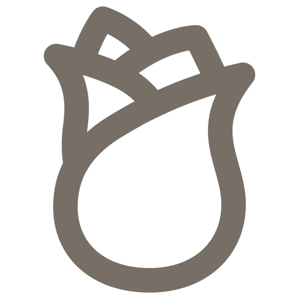

# 2048: Way of the Cross

Clone version of the game 2048 with the theme of the Stations of the Cross for the purposes of DCM Hradec Králové.

## Symbols

| NO.                  | NAME                                                                         | SYMBOL                                                                      | ICON                   | SOURCE              |
| -------------------- | ---------------------------------------------------------------------------- | --------------------------------------------------------------------------- | ---------------------- | ------------------- |
| 1.                   | Jesus is condemned to death                                                  | plates of the Ten Commandments or a bowl of water                           |  |
| 2.                   | Jesus takes up his Cross                                                     | fetters or crown of thorns                                                  |  |
| 3.                   | Jesus falls the first time                                                   | a drop of blood or a stone - a hard fall to the ground                      |  |
| 4.                   | Jesus meets his Mother                                                       | heart - symbol of love                                                      |  |
| 5.                   | Simon of Cyrene helps Jesus carry the Cross                                  | helping hand or medicine box - symbol of help                               |  |
| 6.                   | Veronica wipes the face of Jesus                                             | white scarf or helping hand                                                 |  |
| 7.                   | Jesus falls for the second time                                              | syringe or drop of blood                                                    |  |
| 8.                   | Jesus meets the women of Jerusalem                                           | a red rose with sharp thorns or a small doll                                |  |
| 9.                   | Jesus falls for the third time                                               | drop of blood or a piece of rope - a symbol of contempt, scorn and shackles |  |
| 10.                  | Jesus is stripped of his garments (sometimes called the "Division of Robes") | white dress                                                                 |  |
| 11.                  | Jesus is nailed to the Cross                                                 | hammer and nail                                                             |  |
| 12.                  | Jesus dies on the Cross                                                      | torn curtain or cross                                                       |  |
| 13.                  | Jesus is taken down from the Cross                                           | crying person or blue stones - tears                                        |  |
| 14.                  | Jesus is laid in the tomb                                                    | stone or cemetery candles                                                   |  |
| **Way of the Light** | *used as bonus*                                                              |
| 15.                  | Jesus Rises from the Dead                                                    |                                                                             |  | (Mt 28,5-6)         |
| 16.                  | The Disciples Discover the Empty Tomb                                        |                                                                             |  | (Jan 20,6-8)        |
| 17.                  | The Risen Lord Appears to Mary Magdalen, Apostle to the Apostles             |                                                                             |  | (Jan 20,16.18)      |
| 18.                  | The Risen Lord Appears on the Road to Emmaus                                 |                                                                             |  | (Lk 24,13.15.25.27) |
