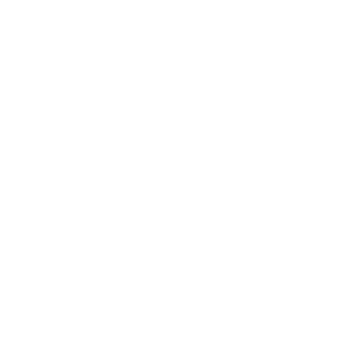

# 2048: Way of the Cross

Clone version of the game 2048 with the theme of the Stations of the Cross for the purposes of DCM Hradec Králové.

Using new Way of the Cross aproved by Benedikt XVI.

## New way symbols

| NO. | NAME                                               | ICON              | NOTION |
| --- | -------------------------------------------------- | ----------------- | ------ |
| 1.  | Jesus in the Garden of Olives                      |  |
| 2.  | Jesus is betrayed by Judas and arrested            |  |
| 3.  | Jesus is condemned by the Sanhedrin                |  |
| 4.  | Jesus is denied by Peter                           |  |
| 5.  | Jesus is judged by Pilate                          |  |
| 6.  | Jesus is scourged and crowned with thorns          |  |
| 7.  | Jesus takes up his cross                           |  |
| 8.  | Jesus is helped by the Cyrenean to carry his cross |  |
| 9.  | Jesus meets the women of Jerusalem                 |  |
| 10. | Jesus is crucified                                 |  |
| 11. | Jesus promises his Kingdom to the good thief       |  |        |
| 12. | The crucified Jesus, the Mother and the disciple   |  |
| 13. | Jesus dies on the cross                            |  |
| 14. | Jesus is laid in the tomb                          |  |

## Old way symbols

| NO. | NAME                                                                         | SYMBOL                                                                      | ICON                  | NOTION                           |
| --- | ---------------------------------------------------------------------------- | --------------------------------------------------------------------------- | --------------------- | -------------------------------- |
| 1.  | Jesus is condemned to death                                                  | plates of the Ten Commandments or a bowl of water                           |  | a question of conscience and law |
| 2.  | Jesus takes up his Cross                                                     | fetters or crown of thorns                                                  |  |                                  |
| 3.  | Jesus falls the first time                                                   | a drop of blood or a stone - a hard fall to the ground                      |  |                                  |
| 4.  | Jesus meets his Mother                                                       | heart - symbol of love                                                      |  |                                  |
| 5.  | Simon of Cyrene helps Jesus carry the Cross                                  | helping hand or medicine box - symbol of help                               |  |                                  |
| 6.  | Veronica wipes the face of Jesus                                             | white scarf or helping hand                                                 |  |                                  |
| 7.  | Jesus falls for the second time                                              | syringe or drop of blood                                                    |  |                                  |
| 8.  | Jesus meets the women of Jerusalem                                           | a red rose with sharp thorns or a small doll                                |  |                                  |
| 9.  | Jesus falls for the third time                                               | drop of blood or a piece of rope - a symbol of contempt, scorn and shackles |  |                                  |
| 10. | Jesus is stripped of his garments (sometimes called the "Division of Robes") | white dress                                                                 |  |                                  |
| 11. | Jesus is nailed to the Cross                                                 | hammer and nail                                                             |  |                                  |
| 12. | Jesus dies on the Cross                                                      | torn curtain or cross                                                       |  |                                  |
| 13. | Jesus is taken down from the Cross                                           | crying person or blue stones - tears                                        |  |                                  |
| 14. | Jesus is laid in the tomb                                                    | stone or cemetery candles                                                   |  |                                  |
